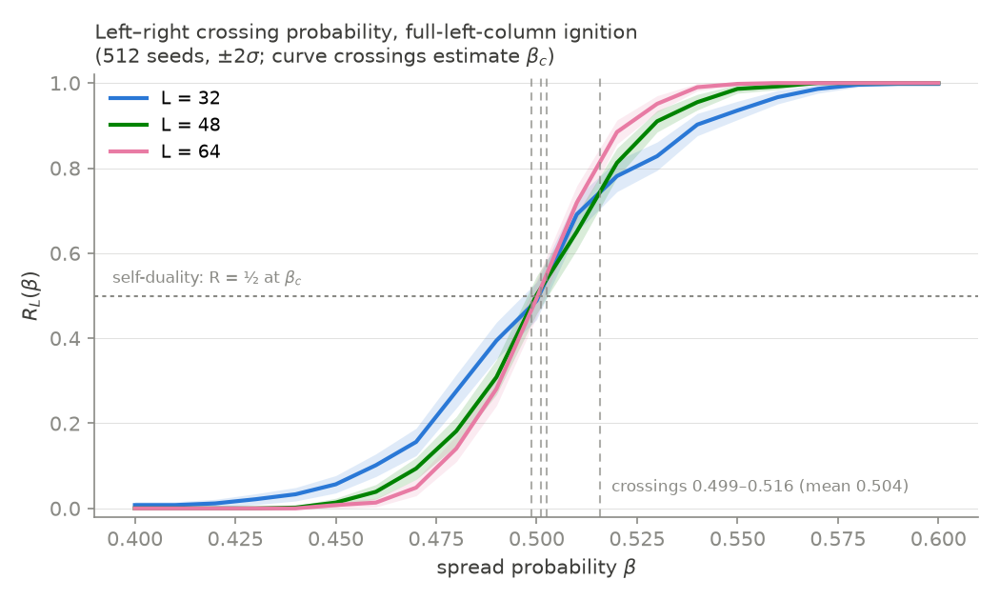

# M2.2 Calibration Report — Percolation Estimates (theory §3)

Date: 2026-07-19, amended same day per spec correction (R_L crossing mode).
Data: `calibration.npz` (M2.1 span sweep) + `calibration_crossing.npz`
(amendment sweep), both RTX 5090, jax 0.11.0, cuda:0, seeds 0, 512 seeds per
(L, β), L ∈ {32, 48, 64}, T_max = 4L, common random numbers across β
(monotone coupling, Prop. 2). Span protocol: all-Fuel grid, single center
ignition, 35 β (0.05–0.95 coarse + 0.40–0.60 at 0.01). Crossing protocol:
full left column ignited at t=0, `crossed` = fire reaches the right column
(the canonical left–right crossing probability R_L(β)), fine grid only.

**Actual GPU budget:** span sweep 4.0 s wall (1.70/1.07/1.17 s per L),
crossing sweep 3.7 s (1.65/1.00/1.06 s). Analysis is pure CPU
(`uv run python -m che.calibration.estimates`, < 10 s).

## β̂_c estimates (amended spec: report all, with spread)

| Estimator | β̂_c |
|---|---|
| (a) crossings of R_L pairs — L32×L48: 0.499, 0.502, 0.516; L48×L64: 0.501 | **mean 0.504** |
| (b) P_span = ½ locus extrapolated vs L^(−3/4) (ν = 4/3 exact) | **0.513** |
| (b, sensitivity) same locus, plain 1/L fit | 0.504 |
| (c) steepest slope of P_span at L = 64 (central differences, fine grid) | **0.480** |
| cross-check: logistic-fit midpoint at L = 64 (scale s = 0.022) | 0.489 |

**Spread across (a)/(b)/(c): [0.480, 0.513], consensus mean 0.499.** All
estimators sit inside the theory §10 band [0.42, 0.58] (unchanged by the
amendment) and bracket the idealized von-Neumann value β_c = ½. The L32×L48
pair crosses three times (0.499–0.516) — near β_c the two curves run nearly
parallel at this seed count, so multiple noise-level crossings are expected;
all are reported, none discarded. ½-loci feeding (b): β_half(32) = 0.467,
β_half(48) = 0.478, β_half(64) = 0.486.

**Self-duality soft check (report, not a hard test):** measured R at the
consensus β̂_c = 0.499: R_32 = 0.479, R_48 = 0.484, R_64 = 0.474 — all
within 0.026 of the self-dual value ½ (≈ 1σ binomial at 512 seeds). The
CA's effective bond structure behaves like a self-dual family at
criticality, as the idealized kernel predicts.

## Methods note — why the original estimator (a) was replaced

The original spec asked for β̂_c from pairwise crossings of the three
center-seed P_span curves. Those crossings do not exist for that
observable: `spanned` is "center ignition ever touches the boundary", so a
smaller grid is easier to span at *every* β — the finite-size bias is
one-sided, and with common random numbers P_span^{L32} ≥ P_span^{L48} ≥
P_span^{L64} holds pointwise across the entire fine grid (the only zero of
any pairwise difference is an exact tie at β = 0.52 with same-signed
neighbors — a touch, not a crossing). Curve-crossing estimators require an
observable whose finite-size bias flips sign across β_c; the left–right
crossing probability R_L is the canonical such observable, and its curves
cross cleanly (figure above). The spec was amended accordingly
(2026-07-19, human-approved); the center-seed spanning curves are retained
for estimators (b)/(c), where one-sidedness is harmless. (Candidate
appendix text for the paper.)

## χ̂(β) — mean burnt cluster size (subcritical side)

χ̂(β) = mean over non-spanning runs of burnt_fraction × L². Saved per L in
`estimates.npz` (`chi_hat_L{32,48,64}` with `n_non_spanning_L*` support
counts) — **Phase 3's Prop.-3 test reuses this curve.**

- Classic susceptibility shape: smooth growth from ~1.2 cells at β = 0.05,
  divergent peak near criticality, collapse on the supercritical side
  (surviving non-spanning runs are early die-outs).
- Peak grows with L — 43 (L32, at β = 0.44) → 87 (L48, 0.46) → 128 (L64,
  0.47) — and the peak location drifts toward β̂_c with L, both standard
  finite-size signatures of a continuous transition.
- Right tail (β ≳ 0.6) rests on < 32 non-spanning runs of 512 and is shown
  dotted in the figure; treat it as unsupported.

## v̂(β) — supercritical front speed

v̂ = least-squares slope of the seed-mean front radius over its linear
regime, defined as mean radius ∈ [20%, 80%] of the saturation radius L∕2;
NaN where the 80% level is never reached (no established front — i.e. not
supercritical). Fit windows are saved in `estimates.npz`
(`v_fit_t_{lo,hi}_L*`).

- v̂ is defined only for β ≥ 0.51–0.52, consistent with the β̂_c estimates.
- Monotone increasing over the defined range: 0.36 → 0.99 cells/step
  (β = 0.51 → 0.95 at L = 48/64).
- The three grid sizes collapse onto one curve (front speed is a bulk
  property; finite-size effects are visible only at the smallest β).
- Def.-4 High-band criterion v̂ ∈ [0.5, 1.0] cells/step corresponds to
  **β ≳ 0.53** at L = 64 — the entire usable supercritical range, so the
  M2.4 High pick will need a choice within it (report will propose one).

## M2.4 — severity bands (HUMAN-LOCKED 2026-07-19)

Locked by the owner+RA decision record `severity_lock.md`, which fixes
β̂_c = 0.500 ± 0.005 from the R_L crossing family (logistic centers
0.4985/0.5006/0.4999 across L; self-duality R(0.500) = 0.488/0.502/0.494,
all within 1σ of the exact ½ — the CA port is quantitatively validated
against Kesten's β_c = ½). Configs emitted with full provenance:

| Severity | β | Measured (L = 64, 512 seeds) | Spec band |
|---|---|---|---|
| Low (`severity_low.yaml`) | 0.43 | P_span 0.021, bf 1.9% | P_span<0.05 ∧ bf∈[1,5]% ✓ |
| Medium (`severity_medium.yaml`) | 0.49 | P_span 0.547, bf 19.8% | P_span∈[0.3,0.7] ✓ |
| High (`severity_high.yaml`) | 0.70 | v̂ 0.83 c/step, bf 98.3%, P_span 0.998 | v̂∈[0.5,1.0] ✓ |

All observables re-verified against `calibration.npz` (sha256 `c131ba72…`)
/ `estimates.npz` before emission and quoted in each config header.
Medium sits between the finite-size pseudo-critical point β_c(64) ≈ 0.486
and β̂_c (maximal-fluctuation regime for the arena); High leaves the front
at 83% of agent speed (outrunnable, barely) with ~98% of the arena
eventually burning. The Phase-1 placeholder β = 0.35 fails the Low band
(bf 0.34% < 1%) — the calibration materially moved the operating points.

## Files

- `calibration.npz`, `calibration_provenance.json` — M2.1 span sweep.
- `calibration_crossing.npz`, `calibration_crossing_provenance.json` —
  amendment sweep (R_L observable).
- `estimates.npz` — all curves (P_span ± SE, R_L ± SE, χ̂ + support, v̂ +
  fit windows, β_half per L).
- `estimates.json` — β̂_c summary (the table above, machine-readable).
- `p_span_sigmoids.png`, `r_crossing.png`, `chi_hat.png`,
  `front_speed.png` — report figures.
- Reproduce: `uv run python -m che.calibration.estimates` (CPU, < 10 s).
