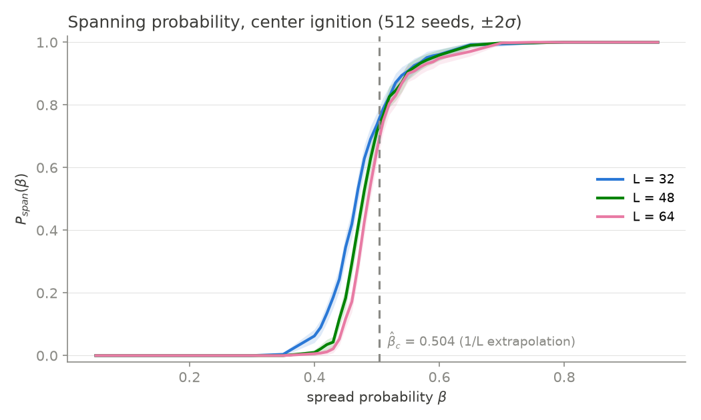
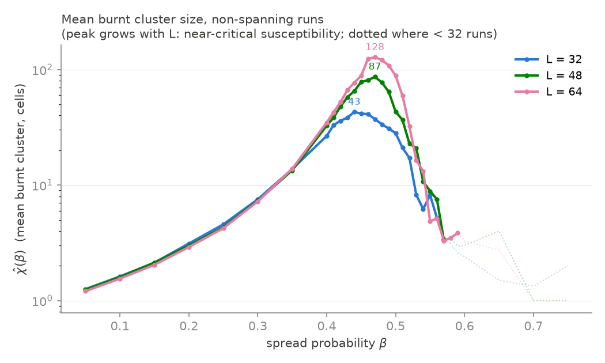
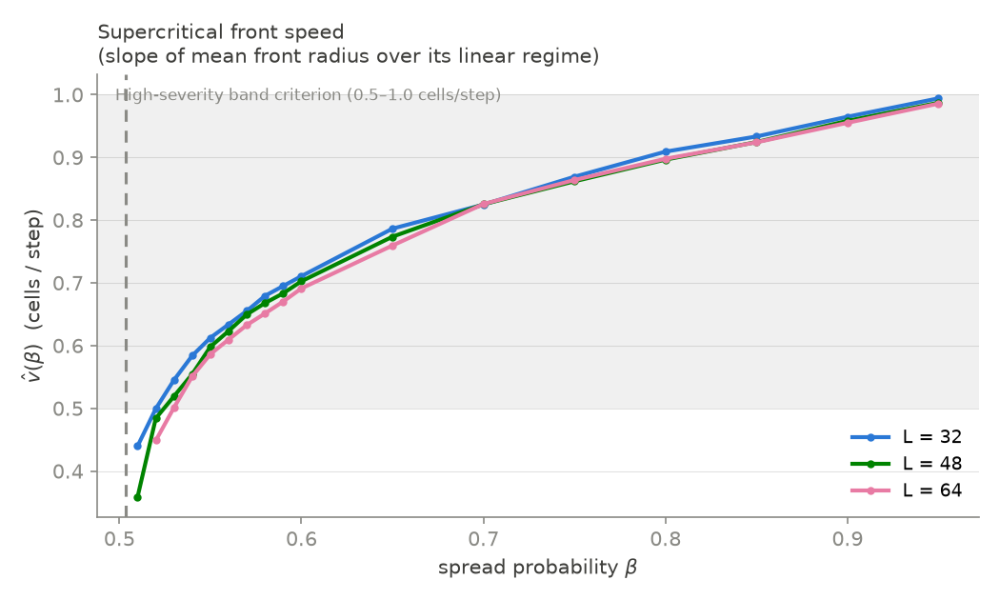

# M2.2 Calibration Report — Percolation Estimates (theory §3)

Date: 2026-07-19. Data: `calibration.npz` (M2.1 sweep, RTX 5090, jax 0.11.0,
cuda:0, repo commit `5129c53`, seed 0). Protocol: all-Fuel L×L grid, single
center ignition, T_max = 4L fixed CA steps, 35 β values (0.05–0.95 coarse,
0.40–0.60 at 0.01), 512 seeds per (L, β), common random numbers across β
(monotone coupling, Prop. 2), L ∈ {32, 48, 64}.

**Actual GPU budget:** 4.0 s wall total (L32 1.70 s, L48 1.07 s, L64 1.17 s)
— vs. the "minutes" budget in the phase prompt. Analysis (this milestone) is
pure CPU/numpy: `che/calibration/estimates.py`.

## β̂_c estimates

| Estimator | β̂_c |
|---|---|
| (a) pairwise finite-size curve crossings | **none exist** (see deviation note) |
| (a′) replacement: P_span = ½ locus, extrapolated linearly in 1/L | **0.504** |
| (b) steepest slope of P_span at L = 64 (central differences, fine grid) | **0.480** |
| (b′) cross-check: logistic fit midpoint at L = 64 (scale s = 0.022) | 0.489 |

P_span = ½ loci: β_half(32) = 0.467, β_half(48) = 0.478, β_half(64) = 0.486;
the 1/L fit has slope −1.19 and intercept 0.504. All estimates sit inside the
theory §10 acceptance band [0.42, 0.58], and the size-extrapolated estimate
is within 1% of the idealized von-Neumann kernel value β_c = ½. The M2.3
theory test can bind against either estimator.

**Deviation note (estimator (a), flagged for human sign-off):** the spec
asked for β̂_c from pairwise crossings of the three finite-size curves.
Those crossings do not exist for the M2.1 spanning observable: `spanned` is
"center ignition ever touches the boundary", so a smaller grid is easier to
span at *every* β — the finite-size bias is one-sided, and with common
random numbers P_span^{L32} ≥ P_span^{L48} ≥ P_span^{L64} holds pointwise
across the entire fine grid (the only zero of any pairwise difference is an
exact tie at β = 0.52 with same-signed neighbors — a touch, not a crossing).
Curve-crossing estimators require an observable whose finite-size bias flips
sign across β_c (e.g. side-to-side spanning), which the sweep did not
record. The ½-locus + 1/L extrapolation above is the standard replacement
for a one-sided observable. If a genuine crossing estimator is wanted, a
follow-up sweep recording side-to-side spanning is a ~10-line change and
~4 s of GPU. The crossing search itself is implemented and honest
(`pairwise_crossings`, returns empty on this data).

## χ̂(β) — mean burnt cluster size (subcritical side)

χ̂(β) = mean over non-spanning runs of burnt_fraction × L². Saved per L in
`estimates.npz` (`chi_hat_L{32,48,64}` with `n_non_spanning_L*` support
counts) — **Phase 3's Prop.-3 test reuses this curve.**

- Classic susceptibility shape: smooth growth from ~1.2 cells at β = 0.05,
  divergent peak near criticality, collapse on the supercritical side
  (surviving non-spanning runs are early die-outs).
- Peak grows with L — 43 (L32, at β = 0.44) → 87 (L48, 0.46) → 128 (L64,
  0.47) — and the peak location drifts toward β̂_c with L, both standard
  finite-size signatures of a continuous transition.
- Right tail (β ≳ 0.6) rests on < 32 non-spanning runs of 512 and is shown
  dotted in the figure; treat it as unsupported.

## v̂(β) — supercritical front speed

v̂ = least-squares slope of the seed-mean front radius over its linear
regime, defined as mean radius ∈ [20%, 80%] of the saturation radius L∕2;
NaN where the 80% level is never reached (no established front — i.e. not
supercritical). Fit windows are saved in `estimates.npz`
(`v_fit_t_{lo,hi}_L*`).

- v̂ is defined only for β ≥ 0.51–0.52, consistent with the β̂_c estimates.
- Monotone increasing over the defined range: 0.36 → 0.99 cells/step
  (β = 0.51 → 0.95 at L = 48/64).
- The three grid sizes collapse onto one curve (front speed is a bulk
  property; finite-size effects are visible only at the smallest β).
- Def.-4 High-band criterion v̂ ∈ [0.5, 1.0] cells/step corresponds to
  **β ≳ 0.53** at L = 64 — the entire usable supercritical range, so the
  M2.4 High pick will need a choice within it (report will propose one).

## M2.4 preview (bands look non-empty at L = 64)

Not locked here — M2.4 proposes, human locks. Quick reads from the L = 64
data: **Low** (P_span < 0.05 ∧ mean burnt_fraction ∈ [1, 5]%) is satisfiable
at β = 0.42 (P_span 0.012, bf 1.40%) and β = 0.43; notably the Phase-1
placeholder β = 0.35 *fails* the Low band (bf 0.34% < 1%). **Medium**
(P_span ∈ [0.3, 0.7]) spans β ≈ 0.47–0.51. **High** (v̂ ∈ [0.5, 1.0]) spans
β ≈ 0.53–0.95.

## Files

- `calibration.npz`, `calibration_provenance.json` — M2.1 raw sweep (input).
- `estimates.npz` — all M2.2 curves (P_span ± SE, χ̂ + support, v̂ + fit
  windows, β_half per L).
- `estimates.json` — β̂_c summary (the table above, machine-readable).
- `p_span_sigmoids.png`, `chi_hat.png`, `front_speed.png` — report figures.
- Reproduce: `uv run python -m che.calibration.estimates` (CPU, < 10 s).
