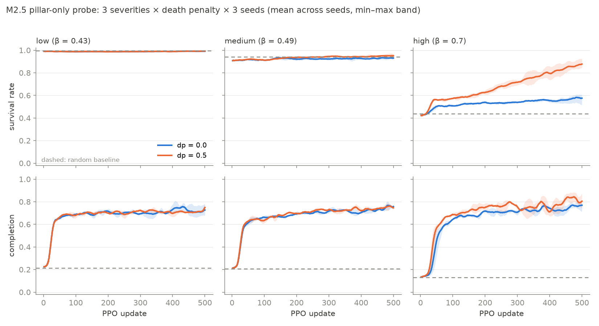

# Phase 2 — Final Report (severity calibration + pillar-only probe)

Date: 2026-07-19. Milestones M2.1–M2.5 complete; suite: 74 fast tests +
3 slow theory tests green on CPU. GPU runs: RTX 5090, jax 0.11.0, vast.ai.

## What Phase 2 built

- **M2.1 calibration engine:** pure-hazard percolation sweeps reusing
  `hazard_step` unchanged; span mode (center ignition, 35 β × 512 seeds ×
  L ∈ {32,48,64}) + crossing mode (full-left-column ignition → R_L(β),
  amendment 2026-07-19, fine grid). GPU cost: **4.0 s + 3.7 s wall** (vs
  "minutes" budgeted).
- **M2.2 estimates:** β̂_c from (a) R_L pair crossings → 0.504, (b)
  ½-locus vs L^(−3/4) → 0.513 (1/L: 0.504), (c) steepest slope L64 →
  0.480; spread [0.480, 0.513]. Self-duality soft check R(β̂_c) ≈ 0.474–
  0.484 (~1σ from ½). χ̂(β) saved for Phase 3's Prop.-3 test. Full
  detail: `calibration_report.md`.
- **M2.3 theory test:** `test_percolation.py` (@slow, 3.3 s): P_span
  isotonic within 2σ, β̂_c ∈ [0.42, 0.58], v̂ increasing — green.
- **M2.4 severity lock (human):** `severity_lock.md` fixed β̂_c = 0.500 ±
  0.005 and locked **Low 0.43 / Medium 0.49 / High 0.70**; configs
  emitted with measured observables + npz hashes in headers.
- **`mean_smoke_exposure`** episode metric added (mean smoke at alive
  agents' cells, time-averaged; info-only, Def. 2 untouched) and wired
  through IPPO/PBT logs — reported below.

## M2.5 pillar-only training probe

Grid: 3 locked severities × death_penalty ∈ {0.0, 0.5} × 3 seeds =
**18 runs**, 500 updates each (dynamic mode, single policy, 64², 12
agents, n_envs 256). **Actual GPU budget: 18 × ~265 s ≈ 79.5 min ≈ 1.33
GPU-hours** (vs ~6 budgeted; ~70k train env-steps/s sustained). Random
baselines: 64-episode GPU runs per severity (`baseline_*.json`).

Final metrics: NaN-safe mean over the last 50 logged updates; across-seed
mean ± half min–max range. Reproduce: `uv run python
che/scripts/plot_m25_grid.py`.

| severity | dp | completion | survival_rate | deaths_fire | mean_smoke_exposure |
|---|---|---|---|---|---|
| low | 0.0 | 0.715 ± 0.048 | 0.991 ± 0.001 | 0.112 ± 0.009 | 0.0001 ± 0.0000 |
| low | 0.5 | 0.722 ± 0.008 | 0.992 ± 0.002 | 0.101 ± 0.024 | 0.0001 ± 0.0000 |
| low | *random* | *0.214* | *0.995* | *0.062* | *0.0000* |
| medium | 0.0 | 0.750 ± 0.015 | 0.931 ± 0.012 | 0.824 ± 0.140 | 0.0004 ± 0.0001 |
| medium | 0.5 | 0.750 ± 0.015 | 0.951 ± 0.012 | 0.590 ± 0.141 | 0.0003 ± 0.0001 |
| medium | *random* | *0.206* | *0.940* | *0.719* | *0.0003* |
| high | 0.0 | 0.765 ± 0.032 | 0.575 ± 0.038 | 5.098 ± 0.450 | 0.0042 ± 0.0003 |
| high | 0.5 | 0.821 ± 0.049 | 0.866 ± 0.038 | 1.612 ± 0.454 | 0.0057 ± 0.0007 |
| high | *random* | *0.129* | *0.438* | *6.750* | *0.0045* |

### Findings

1. **Completion beats random at every cell** (3.3–6.4×), so the task is
   learned everywhere; the severities differentiate *how it must be
   learned*.
2. **Survival degrades with severity** (expected pattern ✓): ~0.99 →
   ~0.94 → 0.58/0.87. Low is at ceiling — random already survives 0.995,
   confirming the Phase-1 finding that motivated this grid.
3. **The death penalty matters exactly where Phase 1 predicted it would
   and nowhere else.** Low: statistically tied (ranges overlap). Medium:
   modest, consistent gain (survival 0.931 → 0.951; deaths −28%). High:
   **decisive** — survival 0.575 → 0.866, deaths_fire 5.10 → 1.61 (−68%),
   and completion *also improves* (0.765 → 0.821). At dp = 0 in High the
   return-optimal policy spends agents for food (survival barely above
   random's 0.438); pricing deaths pushes it to evacuation-aware foraging
   that is better on both axes. The dp = 0.5 High survival curve is still
   climbing at update 500.
4. **Across-seed variance (theory Def. 4 prediction: Medium highest) —
   observed otherwise; reported, not forced.** Final-survival min–max
   range: Low ~0.002–0.004, Medium ~0.023, High ~0.075 — monotone in
   severity, not peaked at Medium. Caveats: n = 3 seeds; the range
   conflates near-critical *environment* fluctuations with *learning*
   variance, and High's slower, still-rising survival curve contributes
   trajectory spread. The Def.-4 prediction concerns per-episode outcome
   variance at fixed policy — testable later from evaluation rollouts at
   fixed checkpoints, where Medium may yet lead.
5. **mean_smoke_exposure** tracks severity over ~50× (0.0001 → 0.0004 →
   0.005). Nuance at High: dp = 0.5 shows *higher* exposure than dp = 0
   (0.0057 vs 0.0042) — exposure is conditioned on being alive, and the
   dp = 0.5 policy keeps agents alive longer inside a burning arena;
   dead agents inhale nothing. Worth remembering when Coupling B makes
   smoke operationally costly.

## Phase-2 exit state

- Severity levels are now **measured dynamical phases** (theory Def. 4),
  not arbitrary β values: sub/near/super-critical, locked in
  `severity_lock.md` + `severity_{low,medium,high}.yaml`.
- The CA kernel is quantitatively validated (β̂_c = 0.500 vs Kesten's ½;
  self-duality within 1σ) and guarded by a slow theory test.
- χ̂(β) is on disk for Phase 3's Prop.-3 Coupling-A scaling test.
- Total Phase-2 GPU spend: **≈ 1.4 GPU-hours** (calibration ~8 s +
  probe ~79.5 min), well inside budget.

**GO/NO-GO on Phase 3 (Coupling A + Prop.-3 scaling test): human call.**
