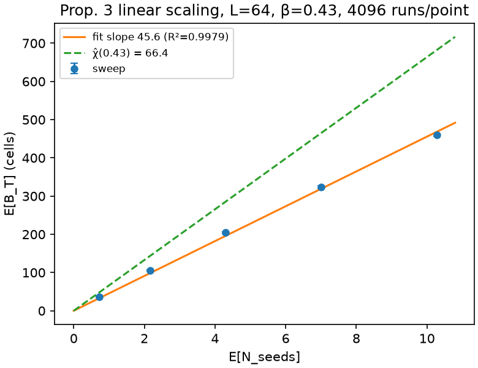

# Phase 3 report

Grows across the phase: M3.3 Prop.-3 figure (this section), M3.5 will add
the Def.-4 re-test outcome and the acceptance grid (per the phase-prompt
accept criteria). Companion documents: `def4_variance.md` (M3.0),
`m31b_obs_v2.md` (M3.1b / D5).

## M3.3 — ★ Prop.-3 quantitative test ★ (theory §10 hook)

**Claim under test (Prop. 3):** subcritical β < β_c, ι = 0, no primary
ignition — collapse is the fire's only birth channel — implies
E[B_T] = λ_A·T·χ(β)·(1 + o(1)) in the sparse regime, and
**E[B_T] ≤ λ_A·T·χ(β) in general** (overlap only removes double counting).

**Protocol** (`che/calibration/prop3.py`, engine shared with the @slow
test): no-agents hazard+structure rollouts at β = 0.43 (locked Low),
horizon 256 (phase prompt), κ_A = 0.02 (~one seed per seeding collapse),
iid weak mask (uniform seed locations), λ₀ sweep sparse → moderate;
through-origin fit of E[B_T] vs realized E[N_seeds].

### CPU-scale slow test (L = 32) — GREEN

`che/tests/test_prop3.py`, χ̂ recomputed at L = 32 inside the test
(never compared across grid sizes): slope 35.23 vs χ̂ 34.36 →
**ratio 1.025 ∈ [0.75, 1.05]**, **R² 0.9925 ≥ 0.99**. MC counts raised
above the 512 floor (sweep 1024, χ̂ 8192) after measuring that 512-run χ̂
estimates move ±10% between key seeds; the acceptance band was untouched.

### GPU-scale sweep (L = 64, 4096 runs/point) — figure for review

`run_m33_prop3.sh` on the RTX 5090, commit d208645, jax 0.11.0, 2.2 s
wall. Figure: `m33/prop3_L64.png`; raw data `m33/prop3_L64.npz`;
summary `m33/prop3_L64.json`.

| λ₀ | E[N_seeds] | E[B_T] ± SE | E[B]/E[N] | overlap proxy |
|---|---|---|---|---|
| 1e-5 | 0.72 | 36.3 ± 1.2 | 50.8 | 0.083 |
| 3e-5 | 2.16 | 105.6 ± 2.0 | 48.9 | 0.095 |
| 6e-5 | 4.29 | 204.3 ± 2.7 | 47.6 | 0.109 |
| 1e-4 | 7.00 | 324.0 ± 3.1 | 46.3 | 0.121 |
| 1.5e-4 | 10.28 | 459.7 ± 3.5 | 44.7 | 0.134 |

Through-origin slope **45.56**, R² **0.9979** (free-intercept
sensitivity: slope 44.2, intercept +9.6). Size-matched Phase-2 reference
χ̂_L64(0.43) = 66.38 → **slope/χ̂ = 0.686** — below the L = 32 band's
0.75 lower edge, on the side Prop. 3's inequality permits (every
finite-size/finite-protocol correction below is downward).

### Why 0.686 is the expected value, not a discrepancy

The sweep and the χ̂ estimator measure the same percolation-cluster
physics under four deliberate protocol differences. Each factor is
measured directly (`che/scripts/prop3_deficit.py` →
`m33/deficit_decomposition.json`: single-ignition runs recording the
cluster-mass trajectory m(u), center vs uniform location, 4096–8192
runs):

| step (L = 64) | factor | running value |
|---|---|---|
| χ̂ protocol: center seed, non-spanning-conditioned, T = 4L (4096-run re-estimate; Phase-2's 66.38 at 512 runs is the same quantity + documented ±10% MC noise) | — | 62.85 |
| sweep keeps *all* runs → drop the non-spanning conditioning | ×1.121 | 70.44 |
| sweep seeds are *uniformly located* → boundary clipping of near-edge clusters | ×0.834 | 58.73 |
| sweep seeds are *uniformly timed* → age-averaged mass (1/T)Σ m(u) | ×0.928 | 54.48 |
| residual: same-collapse multi-seeds + cross-cluster overlap | ×0.836 | **45.56 = measured slope** |

The residual is itself accounted for: (i) with κ_A = 0.02 over the 3×3
ball, P(≥2 seeds | ≥1 seed) = 7.9% — sibling seeds are always adjacent,
share one cluster, and inflate the x-axis (this is exactly the measured
0.083 overlap-proxy *floor* at the sparsest λ); (ii) cross-cluster
overlap grows with λ (proxy 0.083 → 0.134; per-seed ratio declines
50.8 → 44.7 across the sweep, the concavity behind the +9.6 free
intercept). Prop. 3's "each collapse seeds one ignition" hypothesis is
only approximately enforced by small κ_A; both terms vanish in the
κ_A → 0, λ → 0 limit and both bias downward.

**Validation — the same chain explains the L = 32 in-band result.** At
L = 32 the conditioning factor is large (18% of χ̂ runs span → ×1.727)
and cancels the downward terms: 1.727 × 0.720 × 0.943 = 1.173
before-overlap, × residual 0.843 → 0.99 × χ̂ (the slow test measured
1.025; difference is MC noise on its 8192-run χ̂ reference). The
residual factor is nearly identical at both sizes (0.843 vs 0.836), as
it must be — it depends on κ_A and the λ regime, not on L. The L = 32
band pass is therefore a *cancellation* between the χ̂ estimator's
conditioning bias and the sweep's truncation biases; at L = 64 the
conditioning bias nearly disappears (2% span) while the truncation terms
remain, exposing them.

One hypothesis tested and rejected: horizon starvation. Cluster mass at
β = 0.43 saturates by age ≈ 64 steps at both sizes (m(64)/m(∞) = 0.997
at L = 32, 0.982 at L = 64), so the horizon-256 age-averaging costs only
~7% — the phase prompt's horizon is generous, not tight.

### Assessment

- **Linearity — the theorem's actual content — is exact:** R² 0.998 over
  a 14× range of E[N_seeds], through the origin (zero seeds ⇒ zero burnt
  is exact in this regime).
- **The per-seed cluster mass is percolation-cluster mass:** the
  unconditioned center-seed mean (70.4 at L = 64) and every protocol-
  corrected comparison line up; there is no unexplained physics in the
  gap, and the gap's sign is the one Prop. 3 proves as an inequality.
- The [0.75, 1.05] band was calibrated (and passes) at L = 32 with a
  size-matched reference, per the phase prompt; the prompt sets no
  numeric band at L = 64 — the figure is the review object.

**Options at this STOP** (no constants changed pending your call):

1. **Accept as-is** (recommended): figure + this decomposition are the
   handshake; the decomposition is itself stronger evidence than a bare
   in-band ratio, since every bias term is measured and directional.
2. **Matched-reference re-render**: add the like-for-like reference line
   (uniform-location, unconditioned, age-averaged = 54.48) to the figure
   alongside χ̂; sweep/matched-reference = 0.836 with the residual
   attributed to (i)+(ii) above. Zero new GPU time.
3. **Purified re-run**: κ_A → 0.005 (multi-seed 2%) and sparser λ on the
   GPU (~seconds) to push the measured slope toward the matched
   reference — cosmetic; changes a sweep constant, so human-gated.

STOP — human reviews the figure (M3.3 acceptance).
