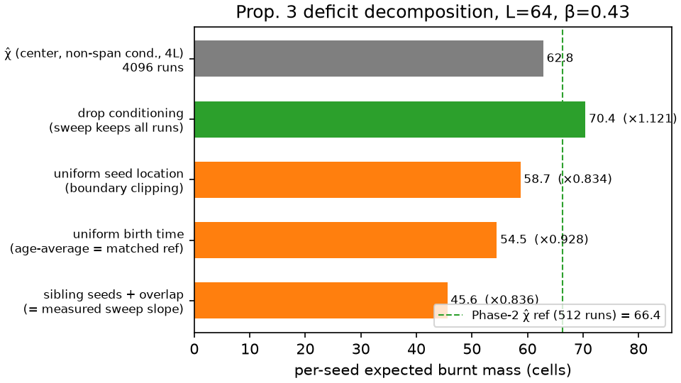

# Phase 3 report

Phase-prompt accept criteria and where they live: the Prop.-3 figure
(M3.3 section below), the Def.-4 re-test outcome (M3.0, measured in
`def4_variance.md`: the survival prediction is REFUTED — variance
monotone with High highest; completion is inconclusive — fixed-policy
ranking medium > low > high but medium and low within CI overlap; the
env-level mechanism is CONFIRMED — burnt-fraction variance peaks near
criticality), and the M3.5 acceptance grid (final section). Companion
documents: `def4_variance.md` (M3.0), `m31b_obs_v2.md` (M3.1b / D5),
`coupling_a_lock.md` (M3.4, repo root).

## M3.3 — ★ Prop.-3 quantitative test ★ (theory §10 hook)

**Claim under test (Prop. 3):** subcritical β < β_c, ι = 0, no primary
ignition — collapse is the fire's only birth channel — implies
E[B_T] = λ_A·T·χ(β)·(1 + o(1)) in the sparse regime, and
**E[B_T] ≤ λ_A·T·χ(β) in general** (overlap only removes double counting).

**Protocol** (`che/calibration/prop3.py`, engine shared with the @slow
test): no-agents hazard+structure rollouts at β = 0.43 (locked Low),
horizon 256 (phase prompt), κ_A = 0.02 (~one seed per seeding collapse),
iid weak mask (uniform seed locations), λ₀ sweep sparse → moderate;
through-origin fit of E[B_T] vs realized E[N_seeds].

### CPU-scale slow test — v1 result and v2 rewrite (ruling)

Test v1 (commit d208645; χ̂ recomputed at L = 32 inside the test):
slope 35.23 vs χ̂ 34.36 → ratio 1.025 ∈ [0.75, 1.05], R² 0.9925. The
M3.3 human ruling (2026-07-21, decision_log.md) logged v1 as an **RA
spec error** — it compared protocol-mismatched quantities and passed
only through the bias cancellation quantified below — and replaced it
with **test v2**: the reference is computed *matched to the sweep's
protocol* inside the test (uniform seed locations, uniform birth times
via age-averaging, unconditional mass; `matched_reference` in
`che/calibration/prop3.py`), the sweep runs purified (κ_A = 0.003 →
P(≥2 seeds | ≥1) = 1.3% ≤ 2%; overlap proxy ≤ 3% asserted), and the
acceptance band is **[0.90, 1.02] × matched_ref, R² ≥ 0.99
(human-locked)**. v2 result: see below.

### GPU-scale sweep (L = 64, 4096 runs/point) — figure for review

`run_m33_prop3.sh` on the RTX 5090, commit d208645, jax 0.11.0, 2.2 s
wall. Figure: `m33/prop3_L64.png` (re-rendered per the ruling with the
protocol-matched reference line beside the naive χ̂ line —
`che/scripts/plot_m33_figures.py`); raw data `m33/prop3_L64.npz`;
summary `m33/prop3_L64.json`.

| λ₀ | E[N_seeds] | E[B_T] ± SE | E[B]/E[N] | overlap proxy |
|---|---|---|---|---|
| 1e-5 | 0.72 | 36.3 ± 1.2 | 50.8 | 0.083 |
| 3e-5 | 2.16 | 105.6 ± 2.0 | 48.9 | 0.095 |
| 6e-5 | 4.29 | 204.3 ± 2.7 | 47.6 | 0.109 |
| 1e-4 | 7.00 | 324.0 ± 3.1 | 46.3 | 0.121 |
| 1.5e-4 | 10.28 | 459.7 ± 3.5 | 44.7 | 0.134 |

Through-origin slope **45.56**, R² **0.9979** (free-intercept
sensitivity: slope 44.2, intercept +9.6). Size-matched Phase-2 reference
χ̂_L64(0.43) = 66.38 → **slope/χ̂ = 0.686** — below the L = 32 band's
0.75 lower edge, on the side Prop. 3's inequality permits (every
finite-size/finite-protocol correction below is downward).

### Why 0.686 is the expected value, not a discrepancy

The sweep and the χ̂ estimator measure the same percolation-cluster
physics under four deliberate protocol differences. Each factor is
measured directly (`che/scripts/prop3_deficit.py` →
`m33/deficit_decomposition.json`: single-ignition runs recording the
cluster-mass trajectory m(u), center vs uniform location, 4096–8192
runs; waterfall panel below):

| step (L = 64) | factor | running value |
|---|---|---|
| χ̂ protocol: center seed, non-spanning-conditioned, T = 4L (4096-run re-estimate; Phase-2's 66.38 at 512 runs is the same quantity + documented ±10% MC noise) | — | 62.85 |
| sweep keeps *all* runs → drop the non-spanning conditioning | ×1.121 | 70.44 |
| sweep seeds are *uniformly located* → boundary clipping of near-edge clusters | ×0.834 | 58.73 |
| sweep seeds are *uniformly timed* → age-averaged mass (1/T)Σ m(u) | ×0.928 | 54.48 |
| residual: same-collapse multi-seeds + cross-cluster overlap | ×0.836 | **45.56 = measured slope** |

The residual is itself accounted for: (i) with κ_A = 0.02 over the 3×3
ball, P(≥2 seeds | ≥1 seed) = 7.9% — sibling seeds are always adjacent,
share one cluster, and inflate the x-axis (this is exactly the measured
0.083 overlap-proxy *floor* at the sparsest λ); (ii) cross-cluster
overlap grows with λ (proxy 0.083 → 0.134; per-seed ratio declines
50.8 → 44.7 across the sweep, the concavity behind the +9.6 free
intercept). Prop. 3's "each collapse seeds one ignition" hypothesis is
only approximately enforced by small κ_A; both terms vanish in the
κ_A → 0, λ → 0 limit and both bias downward.

**Validation — the same chain explains the L = 32 in-band result.** At
L = 32 the conditioning factor is large (18% of χ̂ runs span → ×1.727)
and cancels the downward terms: 1.727 × 0.720 × 0.943 = 1.173
before-overlap, × residual 0.843 → 0.99 × χ̂ (the slow test measured
1.025; difference is MC noise on its 8192-run χ̂ reference). The
residual factor is nearly identical at both sizes (0.843 vs 0.836), as
it must be — it depends on κ_A and the λ regime, not on L. The L = 32
band pass is therefore a *cancellation* between the χ̂ estimator's
conditioning bias and the sweep's truncation biases; at L = 64 the
conditioning bias nearly disappears (2% span) while the truncation terms
remain, exposing them.

One hypothesis tested and rejected: horizon starvation. Cluster mass at
β = 0.43 saturates by age ≈ 64 steps at both sizes (m(64)/m(∞) = 0.997
at L = 32, 0.982 at L = 64), so the horizon-256 age-averaging costs only
~7% — the phase prompt's horizon is generous, not tight.

### Assessment

- **Linearity — the theorem's actual content — is exact:** R² 0.998 over
  a 14× range of E[N_seeds], through the origin (zero seeds ⇒ zero burnt
  is exact in this regime).
- **The per-seed cluster mass is percolation-cluster mass:** the
  unconditioned center-seed mean (70.4 at L = 64) and every protocol-
  corrected comparison line up; there is no unexplained physics in the
  gap, and the gap's sign is the one Prop. 3 proves as an inequality.

### Ruling outcome (human, 2026-07-21 — see decision_log.md)

Accepted with modifications: the dense sweep stays the headline artifact
(purified re-run declined as cosmetic — the dense regime *exercises and
measures* the corrections); the matched-reference line was added to the
figure and the waterfall panel above to this report; the theory doc
gained a human-authored remark on the finite-protocol corrections
(after Prop. 3); the acceptance test was rewritten as v2 with an
internal matched reference and the human-locked band [0.90, 1.02].
The cancellation analysis above is retained verbatim (paper-appendix
candidate).

### Acceptance test v2 result (purified regime, L = 32)

`che/tests/test_prop3.py` v2: κ_A = 0.003, λ ∈ LAMBDAS_L32_PURE
(realized E[N_seeds] 0.11–0.56), SWEEP_MC = 8192, matched reference
from 16384 uniform-location trajectory runs. A pilot (N = 2048) found
the purified ratio centers near 1.00 — the sibling (−1.2%) and overlap
(−1%) deflations are offset by a +~2% seed-location edge effect (the
3×3 seeding dilation underweights boundary cells, whose clusters are
clipped, relative to the exactly-uniform reference); margin analysis is
in the decision log.

**v2 result — GREEN:** slope 41.18 vs matched_ref 41.49 (SE 0.43) →
**ratio 0.992 ∈ [0.90, 1.02]**, **R² 0.9995 ≥ 0.99**; overlap proxy
0.016–0.023 ≤ 0.03 (regime check passed); wall ~18 min CPU (niced).
The ratio sits 0.8% below the matched reference — consistent with the
pilot's bias accounting (sibling −1.2%, overlap −1%, edge effect +~2%)
within its ~2.4% MC error.

## M3.5 — Coupling-A acceptance grid (Phase-3 close-out)

Grid: 3 severities × κ_A ∈ {0, 0.06 (locked)} × 2 seeds, dp = 0.5 (D4),
500 updates, locked Coupling-A params (`coupling_a_lock.md`); the
κ_A = 0 arm keeps full structural dynamics (collapse-kill, blocking) and
removes only the ignition coupling. 512 stochastic eval episodes per
cell (`che.eval.harness`, eval seed 0 — common eval keys across cells).
Runs: `run_m35_grid.sh` on the RTX 5090, ~285 s/train, ~57 min total;
raw evals `m35/eval_*.{json,npz}`, training logs `m35/*.jsonl`;
tables generated by `che/scripts/m35_report.py`.

### per-cell means (512 episodes each)

| cell | completion | survival_rate | deaths_fire | deaths_collapse | collapse_events | seeded_ignitions | blocked_moves | weak_occupancy |
|---|---|---|---|---|---|---|---|---|
| low_ka0_s0 | 0.795 | 0.980 | 0.068 | 0.174 | 7.861 | 0.000 | 2.502 | 0.116 |
| low_ka0_s1 | 0.704 | 0.978 | 0.057 | 0.209 | 7.875 | 0.000 | 2.457 | 0.125 |
| low_kaL_s0 | 0.768 | 0.959 | 0.236 | 0.254 | 7.932 | 4.094 | 2.736 | 0.186 |
| low_kaL_s1 | 0.682 | 0.962 | 0.223 | 0.230 | 7.912 | 4.057 | 3.234 | 0.163 |
| medium_ka0_s0 | 0.708 | 0.935 | 0.545 | 0.234 | 7.900 | 0.000 | 3.895 | 0.170 |
| medium_ka0_s1 | 0.764 | 0.959 | 0.297 | 0.195 | 7.867 | 0.000 | 2.906 | 0.138 |
| medium_kaL_s0 | 0.865 | 0.932 | 0.631 | 0.180 | 7.861 | 3.408 | 4.945 | 0.164 |
| medium_kaL_s1 | 0.772 | 0.927 | 0.594 | 0.279 | 7.967 | 3.428 | 4.326 | 0.206 |
| high_ka0_s0 | 0.801 | 0.915 | 0.867 | 0.156 | 7.846 | 0.000 | 2.971 | 0.148 |
| high_ka0_s1 | 0.888 | 0.895 | 1.064 | 0.191 | 7.873 | 0.000 | 5.412 | 0.153 |
| high_kaL_s0 | 0.788 | 0.817 | 2.053 | 0.145 | 7.828 | 0.828 | 3.465 | 0.150 |
| high_kaL_s1 | 0.822 | 0.924 | 0.713 | 0.195 | 7.867 | 0.828 | 3.564 | 0.142 |

### seed-pooled arm comparison (1024 episodes per arm)

| severity | metric | ka=0 | ka=0.06 | delta |
|---|---|---|---|---|
| low | completion | 0.750 | 0.725 | -0.024 |
| low | survival_rate | 0.979 | 0.961 | -0.018 |
| low | deaths_fire | 0.062 | 0.229 | +0.167 |
| low | deaths_collapse | 0.191 | 0.242 | +0.051 |
| low | collapse_events | 7.868 | 7.922 | +0.054 |
| low | seeded_ignitions | 0.000 | 4.075 | +4.075 |
| low | blocked_moves | 2.479 | 2.985 | +0.506 |
| low | weak_occupancy | 0.120 | 0.174 | +0.054 |
| medium | completion | 0.736 | 0.818 | +0.082 |
| medium | survival_rate | 0.947 | 0.930 | -0.017 |
| medium | deaths_fire | 0.421 | 0.612 | +0.191 |
| medium | deaths_collapse | 0.215 | 0.229 | +0.015 |
| medium | collapse_events | 7.884 | 7.914 | +0.030 |
| medium | seeded_ignitions | 0.000 | 3.418 | +3.418 |
| medium | blocked_moves | 3.400 | 4.636 | +1.235 |
| medium | weak_occupancy | 0.154 | 0.185 | +0.031 |
| high | completion | 0.844 | 0.805 | -0.039 |
| high | survival_rate | 0.905 | 0.871 | -0.034 |
| high | deaths_fire | 0.966 | 1.383 | +0.417 |
| high | deaths_collapse | 0.174 | 0.170 | -0.004 |
| high | collapse_events | 7.859 | 7.848 | -0.012 |
| high | seeded_ignitions | 0.000 | 0.828 | +0.828 |
| high | blocked_moves | 4.191 | 3.515 | -0.677 |
| high | weak_occupancy | 0.151 | 0.146 | -0.005 |

### M3.4-lock addendum: trained-policy drift vs calibration

| severity | metric | random-policy calib | trained (kaL, pooled) | band | flag |
|---|---|---|---|---|---|
| low | collapse_events | 8.461 | 7.922 | [3.0, 10.0] | ok |
| low | seeded_ignitions | 4.469 | 4.075 | [1.0, 5.0] | ok |
| low | deaths_collapse | 0.180 | 0.242 | [0.05, 0.5] | ok |
| medium | collapse_events | 8.422 | 7.914 | [3.0, 10.0] | ok |
| medium | seeded_ignitions | 3.695 | 3.418 | [1.0, 5.0] | ok |
| medium | deaths_collapse | 0.141 | 0.229 | [0.05, 0.5] | ok |
| high | collapse_events | 8.391 | 7.848 | [3.0, 10.0] | ok |
| high | seeded_ignitions | 0.781 | 0.828 | [1.0, 5.0] | n/a (not binding) |
| high | deaths_collapse | 0.102 | 0.170 | [0.05, 0.5] | ok |

### Question (a) — does Coupling A shift behavior (weak-cell load-avoidance)?

**No avoidance shift is detected — the direction is opposite at Low.**
Weak-cell occupancy under κ_A = 0.06 is equal or higher than the
κ_A = 0 arm at Low (+0.054; both κ_A seeds, 0.163/0.186, sit above both
control seeds, 0.116/0.125) and Medium (+0.031, seed ranges overlap);
High shows no difference (−0.005). Two readings, both honest: (i) the
*direct* incentive to avoid weak cells — collapse-kill and blocking —
exists identically in both arms, so the ablation isolates only the
*additional* fire-seeding risk, which at dp = 0.5 is evidently not
worth avoiding terrain for; (ii) at Low the positive delta is plausibly
displacement — seeded fires burn food-bearing regions, pushing foraging
into the (clustered) weak zones. With 2 seeds per cell this is
suggestive, not conclusive; the Low-severity separation (no seed
overlap between arms) is the strongest of the three.

### Question (b) — does Low survival leave the ceiling?

**Yes.** Low survival drops from 0.979 (both control seeds ≥ 0.978) to
0.961 (both κ_A seeds ≤ 0.962), driven by fire deaths rising 3.7×
(0.062 → 0.229/ep) — collapse-seeded fire is now the dominant fire
threat at Low, exactly the Prop.-3 regime the lock targeted (seeded
share 0.763 at calibration). deaths_collapse also rises (+0.051).
Low is no longer a survival-saturated severity under the JOINT
compound.

### M3.4-lock addendum — trained-policy drift: NO FLAGS

All Low (and Medium) realized values remain inside the calibration
bands under trained policies (table above): collapses 7.92 ∈ [3, 10],
seeded 4.08 ∈ [1, 5], deaths_collapse 0.242 ∈ [0.05, 0.5]. Drift vs
the random-policy calibration is small and coherent: collapse events
−6–7 % at every severity (trained survivors redistribute load), seeded
follows collapses proportionally. **High-severity fuel-exhaustion
confirmed under trained policies**: realized seeding 0.83/ep vs the
calibration's 0.78 — while the non-ignition structural channels stay
material at High (blocked moves 3.5–4.2/ep, deaths_collapse 0.17,
comparable to Low/Medium), documenting that Coupling A's *ignition*
channel is what self-limits, not structural relevance.

### Other observations

- **Severity ladder intact in both arms**: survival 0.979/0.947/0.905
  (κ_A = 0) and 0.961/0.930/0.871 (κ_A = 0.06), monotone in severity.
- **Medium completion improves under Coupling A** (+0.082 pooled,
  0.736 → 0.818): consistent with early seeded burns consuming fuel
  before the near-critical mid-episode spread reaches food regions —
  reported, not claimed (seed ranges overlap on one side).
- **M3.1b watch item (v2 medium fire-free coverage)**: not directly
  re-measurable in this grid — the harness has no per-episode burnt
  fraction, and with structure active the env family changed (m31b
  numbers are not comparable across the config change). Recommend
  carrying the watch item to Phase 4 rendering audits rather than
  closing it here.

### Phase-3 acceptance status

`phase3_report.md` now contains the Prop.-3 figure (M3.3, ruling
applied), the Def.-4 re-test outcome (header pointer to
`def4_variance.md`), and the acceptance grid (this section) — the
phase-prompt accept list is complete. **STOP — Phase 3 complete;
GO/NO-GO on Phase 4 (Coupling B + Thm.-1 E2C micro-env) is a human
call.**
