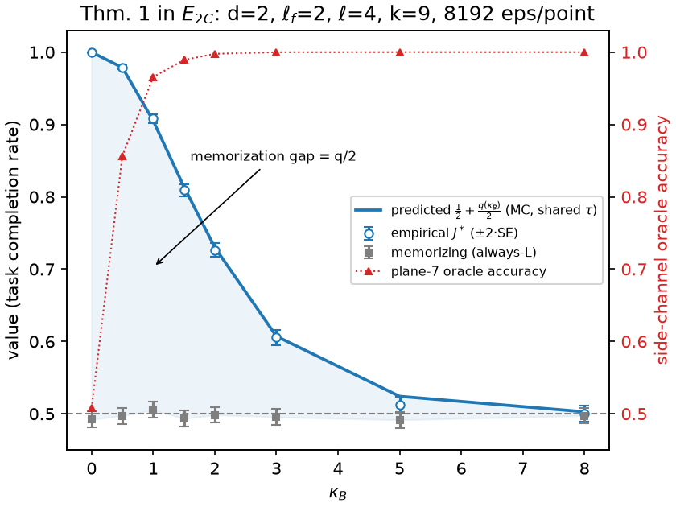

# Phase 4 report

Coupling B live (Def. 6), the Theorem-1 handshake, the κ_B lock and the
acceptance grid. Where the phase-prompt accept criteria live: the M4.0
harness addendum and the M4.1 obs-v3 bench row are recorded in
`che/bench/results/gate_report.md` ("Phase 4 obs v3 — reference cell
re-measurement"); the E2C figure is the M4.2 section below; the κ_B lock
proposal will be `kappa_b_lock.md` (M4.3, repo root, same format as
`coupling_a_lock.md`); the acceptance grid closes this document (M4.4).

## M4.2 — ★ Theorem-1 E2C validation ★ (theory §5 Thm. 1, §10 hook)

**Claim under test (Thm. 1).** In the two-corridor environment
E_2C(κ_B), the optimal value is J\*(κ_B) = ½ + q(κ_B)/2, where q is the
probability of being informed by the commitment point; the memorizing
(signal-blind) policy is worth ½ for every κ_B, so the memorization gap
is exactly q/2 — and Coupling B erodes it continuously, to zero under
total perceptual denial.

### Protocol

`che/env/e2c.py`, engine shared with the `@slow` test and the figure
script (`che/scripts/plot_e2c.py`). Constants are shared by the predicted
and empirical curves — the M3.3 protocol-matching lesson, applied
forward.

- **Geometry (Option A, human ruling 2026-07-27):** d = 2, ℓ_f = 2,
  ℓ = 4, k = 9, grid 13², horizon T = d + ℓ = 6 (zero slack), branch at
  (6, 6), corridors along the row, fire at depth ℓ_f into corridor
  Z ~ U{L, R}. The phase-prompt rule k ≥ 2(d + ℓ_f) + 1 = 9 holds.
- **Hazard:** scripted — the fire cell is held Burning for the whole
  episode. Thm. 1 defines E_2C structurally (corridor Z lethal
  throughout) and the CA kernel is validated elsewhere (Prop. 2,
  Prop. 3); Def. 3's one-step burn-out would delete the theorem's
  hypothesis. What this milestone validates is the *observation* path.
- **Smoke:** the standard (σ_s, η) = (1.0, 0.5) dynamics via the
  production `hazard.smoke_step`, with **one smoke step before the first
  observation** (the fire has been burning since t = 0). Without it
  ρ₀ = 0 ⇒ τ₀ = 1 ⇒ q = 1 trivially at every κ_B. ρ at the fire cell
  therefore runs 1.000, 1.607, 1.974 over the three pre-commitment steps.
- **Observations:** `observation.observe` at obs v3 — the production
  crop, the shared `transmittance`, the per-cell reveal draw, and the
  same `env._OBS_STREAM` fold_in the swarm env uses. No bespoke signal
  channel exists; wrong crop offsets or plane order would collapse J\*
  onto the ½ floor.
- **Predicted curve:** q by Monte Carlo over the reveal randomness —
  Bernoulli(τ) with τ from the shared `transmittance` against the same
  smoke trajectory. It mirrors the rollout protocol exactly but does
  **not** pass through `observe`, and runs on an **independent PRNG
  stream**. Both properties are load-bearing: with shared keys and a
  shared path the test would reduce to the arithmetic identity
  J = q + (1 − q)/2 and would prove nothing.
- **Empirical curve:** the hand-coded policy of the prompt (walk to b;
  if informed take the corridor ≠ Z, else tie-break to L), 8192 episodes
  per κ_B (≥ the 4096 floor), plus the memorizing always-L policy.
- **Grid:** κ_B ∈ {0, 0.5, 1, 1.5, 2, 3, 5, 8}, spanning q ≈ 1 → q ≈ 0.

Raw: `phase4/m42/e2c_sweep.json` (commit 3dbc080 code state),
`e2c_replicates.json`; figure `e2c_theorem1.png`.

### Result

| κ_B | q (MC) | q (analytic) | q (via `observe`) | J\*_emp ± SE | J\*_pred | Δ | z | J_memorizing | plane-7 oracle |
|---|---|---|---|---|---|---|---|---|---|
| 0.00 | 1.0000 | 1.0000 | 1.0000 | 1.0000 ± 0.0000 | 1.0000 | +0.0000 | +0.00 | 0.4922 | 0.5078 |
| 0.50 | 0.9573 | 0.9580 | 0.9562 | 0.9790 ± 0.0016 | 0.9786 | +0.0004 | +0.19 | 0.4973 | 0.8566 |
| 1.00 | 0.8104 | 0.8115 | 0.8143 | 0.9080 ± 0.0032 | 0.9052 | +0.0027 | +0.71 | 0.5054 | 0.9656 |
| 1.50 | 0.6274 | 0.6262 | 0.6283 | 0.8091 ± 0.0043 | 0.8137 | −0.0046 | −0.91 | 0.4933 | 0.9891 |
| 2.00 | 0.4602 | 0.4564 | 0.4523 | 0.7266 ± 0.0049 | 0.7301 | −0.0035 | −0.63 | 0.4985 | 0.9977 |
| 3.00 | 0.2145 | 0.2218 | 0.2190 | 0.6055 ± 0.0054 | 0.6072 | −0.0018 | −0.30 | 0.4956 | 0.9999 |
| 5.00 | 0.0485 | 0.0469 | 0.0432 | 0.5123 ± 0.0055 | 0.5242 | **−0.0119** | **−2.11** | 0.4916 | 1.0000 |
| 8.00 | 0.0056 | 0.0046 | 0.0052 | 0.5000 ± 0.0055 | 0.5028 | −0.0028 | −0.51 | 0.4974 | 1.0000 |

**Three independent routes to q agree at every point** — the MC
prediction (Bernoulli on `transmittance`), the closed product
1 − ∏(1 − τ_t), and the rate measured through the full `observe`
pipeline. The third is the substance of the handshake: it exercises the
crop offsets, the plane order and the reveal plumbing that the
prediction path never touches.

Acceptance, criterion by criterion:

1. **Empirical matches the numeric prediction** — PASS under the final
   three-condition gate (human ruling 2026-07-27, below): (a) max |z| =
   2.11 ≤ 2.69, (b) Σz² = 6.55 on 8 dof → p = 0.586 ≥ 0.05, (c) mean
   z = −0.44, within 0.71.
2. **Memorizing policy flat at ½** — PASS: every point within 2·SE of ½
   (max deviation 0.0084 at κ_B = 5, against 2·SE = 0.0110), no trend
   in κ_B.
3. **J\*(0) ≥ 0.99** — PASS: exactly 1.0000 (τ ≡ 1 ⇒ informed at t = 0
   in every episode).
4. **J\*(large) − ½ ≤ 0.02** — PASS: 0.0000 at κ_B = 8 (q = 0.0056).

### Acceptance gate for criterion 1 — final ruling (human, 2026-07-27)

Supersedes both the phase prompt's per-point 2·SE spec and the interim
joint-χ²-only amendment. Three conditions on the per-point
z = Δ / SE(Δ), **all required**, each catching what the others cannot:

| | condition | catches | measured |
|---|---|---|---|
| (a) | max \|z\| ≤ 2.69 (Šidák FWER 5%) | localized gross error at one κ_B | **2.11** ✓ |
| (b) | Σz² vs χ²(n), p ≥ 0.05 | diffuse magnitude misfit no single point flags (every point at −2σ passes (a), fails (b)) | **6.55 on 8 dof, p = 0.586** ✓ |
| (c) | \|mean z\| ≤ 2/√n = 0.71 | signed systematic drift passing both (every point at −1σ passes (a) and (b), fails (c)) | **−0.44** ✓ |

**GREEN under the final gate.** n counts every grid point; κ_B = 0 is
deterministic (τ ≡ 1 ⇒ q ≡ 1) and contributes z = 0 to all three
statistics. Constants live at the top of `che/tests/test_e2c.py` with
the rationale as one comment block.

Why the prompt's per-point 2·SE was replaced: applied across the 7
informative κ_B values it rejects a *correct* implementation with
probability 1 − 0.9545⁷ = **28%**, and on the pinned seed 0 the κ_B = 5
point lands at 2.11·SE. The replicate diagnostic (8 independent seeds ×
8 points, `e2c_replicates.json`, reproducible with
`plot_e2c.py --replicates 8`) settles which side of that we were on:

| κ_B | 0.5 | 1.0 | 1.5 | 2.0 | 3.0 | 5.0 | 8.0 |
|---|---|---|---|---|---|---|---|
| mean z over 8 seeds | +0.16 | +0.22 | +0.56 | −0.19 | −0.17 | −0.36 | −0.06 |
| sd z | 0.82 | 1.23 | 1.06 | 1.39 | 0.74 | 0.75 | 0.82 |
| \|z\| > 2 count | 0 | 1 | 1 | 1 | 0 | 0 | 0 |

Pooled over the 56 informative (seed, κ_B) cells: **mean z = +0.025,
sd = 0.990, 5.4 % beyond 2σ against 4.6 % expected** — the z-scores are
N(0, 1) to measurement resolution, and a systematic offset larger than
~0.13·SE (≈ 0.0007 in J) would have shown. κ_B = 5's mean z over seeds
is −0.36; seed 0's −2.11 is a fluctuation, not a defect. So the gate was
under-powered, not the implementation biased.

No tolerance was ever adjusted by the RA (CLAUDE.md invariant 4): the
gate was carried to the M4.2 STOP as a report-and-ask under the M3.3
protocol (pinned keys, deterministic committed outcome) and replaced by
the human ruling above. Re-keying to a seed that happens to pass was
considered and rejected as seed-shopping.

### Finding 1 — a documented kernel property (not a bug)

The prompt's *illustrative* geometry (d = 6, k = 17) was measured
unusable before implementation: with a single-cell smoke source the
n_quad = 4 midpoint quadrature never samples the ray's endpoint beyond
axis distance ≈ 4, so **τ = 1.0000 exactly** at the first two steps
(distances 6.32 and 5.39) for every κ_B up to 8 — hence q ≡ 1, a flat
J\* = 1 curve, and criterion 4 unreachable. Shrinking to d = 2 puts all
three pre-commitment distances (2.83, 2.24, 2.00) inside the sampled
regime; the τ profile at κ_B = 1.5 is (0.346, 0.260, 0.228).

Ruled a documented property of the locked M4.1 kernel, recorded in the
`transmittance` docstring and pinned by
`test_isolated_smoke_cell_is_unoccluded_beyond_quadrature_range`
(`che/tests/test_coupling_b.py`): *single-cell smoke sources contribute
no occlusion beyond axis distance ~4 under the midpoint quadrature;
spatially extended sources — what the CA actually produces — are
unaffected.* Option C (an endpoint-inclusive quadrature) was considered
and **rejected**: it would re-open locked M4.1, invalidate its fresh
bench row, and change obs-v3 semantics to serve a regime production
rarely enters. Option B (keeping d = 6 by adding an approach-side smoke
bank) was **rejected** as an unauthorized second smoke source and more
bespoke micro-env machinery than the theorem needs.

*Candidate limitations sentence for the paper:* "Perceptual attenuation
is integrated by a four-point midpoint quadrature along each line of
sight, which resolves the spatially extended smoke plumes the fire
kernel produces but under-resolves isolated single-cell sources at
ranges beyond about four cells; occlusion there is therefore a lower
bound."

### Finding 2 — masking is itself informative (quantified)

Smoke is co-located with the fire, so the ray to the *mirror* corridor
cell crosses no smoke and that cell is always revealed (τ ≡ 1 exactly —
asserted in `test_corridors_are_exchangeable`). "Exactly one candidate
masked" therefore identifies Z from the visibility plane alone, without
ever seeing fire content. Measured accuracy of an oracle that guesses Z
from the plane-7 pattern only (last column of the result table): **0.508
at κ_B = 0 — chance, nothing is masked — then 0.857, 0.966, 0.989,
0.998, and ≥ 0.9999 from κ_B = 3 up.**

So the *implemented* micro-environment's true optimal value is ≈ 1 at
every κ_B, and Thm. 1's J\* is the value of the **content channel
only** — which is what the prompt's q defines and what the scored
policies read. `test_scored_policies_never_read_the_visibility_plane`
enforces this end to end: destroying plane 7 leaves the optimal and
memorizing outcomes bitwise unchanged and collapses the oracle to
chance.

*Candidate footnote for the paper:* "Thm. 1 idealizes occlusion as pure
information loss. In any implementation where attenuation co-locates
with the threat, the mask is itself a signal: in E_2C an observer using
only the visibility channel identifies the burning corridor with
accuracy 0.99 at κ_B = 1.5 and ≈ 1 beyond, while never observing fire.
We score the content channel alone, and note that a learned policy is
free to exploit the residual channel — a conservative choice for the
memorization-gap claim."

### Forward obligations for M4.3

1. **Confirm the detection band sits in the well-sampled regime.** The
   band "P(a Burning cell at crop distance 3 is revealed)" probes
   distance 3 ≤ 4, so Finding 1 does not touch it — make this
   confirmation explicit in `kappa_b_lock.md` rather than implicit.
2. **The E2C cross-reference band maps to κ_B ≈ 1.3–2.6** under Option-A
   geometry (q ∈ [0.3, 0.7] read off the table above: q = 0.70 near
   κ_B = 1.3, q = 0.30 near κ_B = 2.6). This mapping is geometry-
   dependent and must be quoted as such.
3. **If the three lock bands fail to intersect, STOP** with the three
   curves side by side (human ruling 2026-07-27): a non-empty
   intersection was an assumption, and its failure is a finding for the
   lock discussion, not something to route around.
