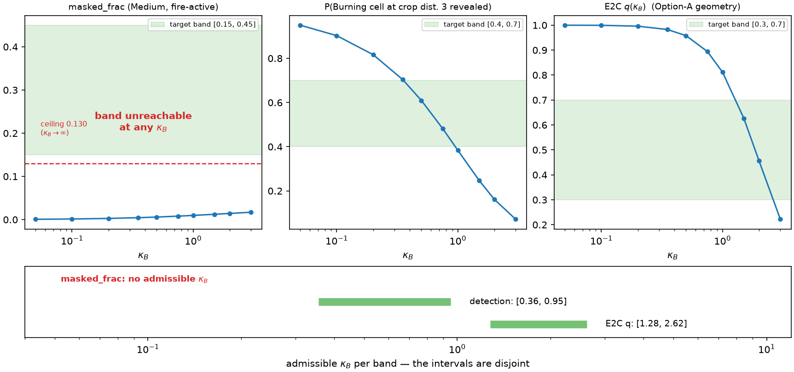

# Coupling-B Lock — M4.3: **κ_B = 1.0 (HUMAN-LOCKED 2026-07-27)**

**Locked value: κ_B = 1.0**, revised from an initial 1.1 before any M4.4
run (see "Revision" below). Ruling, revision and the band analysis that
produced them follow.

## The lock (human + RA, 2026-07-27)

1. **κ_B = 1.0** (initially 1.1; revised below), on a **dominance
   ordering that predates the decision**:
   environment-native bands outrank toy-geometry cross-references. The
   E2C band is geometry-contingent per the M4.2 Option-A ruling — its
   constants were already re-chosen once, for quadrature reasons — so
   E2C is **demoted from hard constraint to consistency check**,
   satisfied within 10 % (q = 0.765 against a 0.70 ceiling).
   **Rejected mirror choice: κ_B = 1.3** (q = 0.694, inside the E2C
   band; detection 0.347, outside the detection band by 0.053).
2. **The masked_frac band is RETIRED as a lock criterion** — not
   widened, not replaced post-hoc. Reason: it measures a
   policy-suppressible quantity, and the suppression is a *finding*, not
   a calibration failure. Post-hoc replacement bands would be
   band-shopping; declined.
3. **Finding recorded — PROVISIONAL → ✗ NOT CONFIRMED (M4.4,
   2026-07-28; see the resolution section at the end of this document):**
   behavioural
   perception-exposure regulation, mechanism = positioning (the crop-
   periphery discriminator measured below). Third member of the
   endogeneity family. **Demoted to provisional 2026-07-27:** both probe
   arms were trained with Coupling B live, so exposure suppression is
   not yet separable from a fire-avoidance *byproduct* — smoke
   co-locates with fire, so any policy that avoids lethal cells also
   reduces the smoke in its crop. **The M4.4 κ_B = 0 arm is the free
   control**: identical lethality incentives, masking bitwise-inert, so
   it carries the byproduct term and nothing else. Cross-arm
   exposure / ceiling / periphery comparison decides — *different* →
   perception-driven regulation confirmed; *indistinguishable* →
   restated as a fire-avoidance byproduct. Either outcome is a clean
   paper sentence.
4. **M4.4 addenda:** (a) report masked_frac conditioned on
   burning-within-crop — danger-moment masking, as a diagnostic, not a
   band; (b) logged **pre-data**: positional suppression may mute the
   swarm-level κ_B ablation delta; if the delta is small, the co-active
   analysis and danger-moment masking carry the interpretive weight — a
   small delta is **not** evidence the coupling is inert. **Inertness
   falsifier, logged pre-data (symmetry restored):** the coupling is
   inert at swarm scale **iff** (i) Δcompletion and Δsurvival are within
   seed noise **and** (ii) there is no cross-arm exposure/positioning
   difference **and** (iii) danger-moment masking is negligible **and**
   (iv) there is no co-active visitation difference. All four → a
   reportable negative result, not a measurement failure; (c) render
   audit: look for smoke-periphery positioning visually.
5. Circularity check acknowledged and closed — the 0.5/1.5 two-arm
   bracket was the right design and cost one extra probe.

### Revision 1.1 → 1.0 (human, 2026-07-27, before any M4.4 run)

The RA measured the detection margin *after* the initial ruling and
found that κ_B = 1.1 satisfies the **dominant** (environment-native)
band under only one of the three measurement conditions available —
and that one is the probe furthest from the lock:

| κ_B | det (random) | det (probe 0.5) | det (probe 1.5) | E2C q | inside the detection band under |
|---|---|---|---|---|---|
| 0.95 | 0.4011 | 0.4557 | 0.4441 | 0.826 | 3/3 measurements |
| **1.00 — LOCKED** | 0.3836 | **0.4383** | **0.4266** | 0.812 | 2/3 |
| 1.10 (initial) | 0.3515 | 0.4045 | 0.3933 | 0.768 | 1/3 |
| 1.30 (rejected mirror) | 0.2952 | 0.3454 | 0.3349 | 0.692 | 0/3 |

Applied consistently, the dominance ordering points below 1.1: the step
from 1.0 to 1.1 buys ~4 points of closeness on the *demoted* E2C
constraint and spends the margin on the band that dominates. κ_B = 1.3
was rejected for being outside the detection band under 0/3
measurements; 1.1 is the same failure mode, milder.

**Locked at 1.0** — inside the band under both probe measurements, which
are the policies the lock actually governs (the random policy is a
calibration instrument, not a deployment condition). **0.95 recorded as
considered**: inside under every measurement, at the cost of the E2C
consistency check moving to 18 %. **1.1 recorded as considered and
superseded.** E2C at the locked value: q = 0.812 against a 0.70 ceiling
— a 16 % miss on the demoted consistency check.

Context at other severities (probe κ_B = 0.5 arm, at κ_B = 1.0):
**Low 0.415** — also inside the [0.4, 0.7] band — and **High 0.281**,
below it. The band is a Medium specification, so this is context, not a
criterion: at High the fire is supercritical and a Burning cell three
away is seen ~28 % of the time. The M4.4 detection-drift check
re-measures all of it under the 500-update policies
(`m44_calibration_kbL.json`).

---

## Appendix — the calibration that produced the lock

(Originally written as the STOP report when the three bands were found
not to intersect.)

Date: 2026-07-27. RA calibration of the full environment
(`che/calibration/coupling_b.py`; 64 episodes/severity, L = 64, 12 agents,
horizon 256, obs v3, Coupling A live at its M3.4-locked values — the
severity YAMLs are loaded directly, so the calibration cannot drift from
the training configs). Raw data
`che/bench/results/phase4/m43/coupling_b_calibration.json` (commit
110da6a, wall 21.6 s, CPU); figure `m43/kappa_b_bands.png`.

This section was written as the M4.2-ruling STOP: "if the three lock
bands fail to intersect, STOP with the three curves side by side; a
non-empty intersection was an assumption, and its failure is a finding
to bring to the lock discussion, not something to route around." No
candidate satisfied even two of the three bands, and one band is
unreachable at **any** κ_B. The ruling above resolves it.

## Targets (phase4_prompt.md M4.3)

| observable | band |
|---|---|
| Medium, alive agents, fire-active steps: `masked_frac` | [0.15, 0.45] |
| P(Burning cell at crop distance 3 revealed \| typical Medium smoke) | [0.4, 0.7] |
| E2C cross-reference q(κ_B) | [0.3, 0.7] |

## Measured sweep (random policy)

`masked_frac` and `detection` are computed as **expectations** — the
mean of (1 − τ) over crop cells and the mean of τ over Burning ring
cells — which are exactly the expectations of the realized channels with
the Bernoulli noise integrated out (pinned against the env's own
`masked_frac` info channel in `test_coupling_b_calib.py`). All
candidates are evaluated on **one rollout per severity** (CRN); for an
obs-blind policy this is exact, since κ_B cannot perturb the trajectory
(invariant #3).

| κ_B | Med masked_frac | masked\|exposed | Med detection | E2C q | detection Low / High | masked Low / High |
|---|---|---|---|---|---|---|
| 0.05 | 0.001 ✗ | 0.003 | 0.950 ✗ | 1.000 ✗ | 0.951 / 0.946 | 0.000 / 0.003 |
| 0.10 | 0.001 ✗ | 0.006 | 0.903 ✗ | 0.999 ✗ | 0.906 / 0.895 | 0.001 / 0.006 |
| 0.20 | 0.003 ✗ | 0.012 | 0.817 ✗ | 0.996 ✗ | 0.821 / 0.803 | 0.001 / 0.012 |
| 0.35 | 0.004 ✗ | 0.020 | 0.704 ✗ | 0.983 ✗ | 0.711 / 0.686 | 0.002 / 0.019 |
| **0.50** | 0.006 ✗ | 0.027 | **0.609 ✓** | 0.958 ✗ | 0.618 / 0.588 | 0.002 / 0.025 |
| 0.75 | 0.008 ✗ | 0.036 | **0.482 ✓** | 0.894 ✗ | 0.491 / 0.459 | 0.003 / 0.033 |
| 1.00 | 0.010 ✗ | 0.043 | 0.384 ✗ | 0.812 ✗ | 0.393 / 0.362 | 0.004 / 0.039 |
| 1.50 | 0.012 ✗ | 0.055 | 0.247 ✗ | **0.626 ✓** | 0.255 / 0.230 | 0.005 / 0.049 |
| 2.00 | 0.014 ✗ | 0.064 | 0.162 ✗ | **0.456 ✓** | 0.168 / 0.149 | 0.005 / 0.055 |
| 3.00 | 0.017 ✗ | 0.076 | 0.072 ✗ | 0.222 ✗ | 0.075 / 0.066 | 0.007 / 0.064 |

Admissible κ_B per band, by log-linear interpolation:

| band | admissible κ_B |
|---|---|
| masked_frac ∈ [0.15, 0.45] | **none — unreachable at any κ_B** |
| detection ∈ [0.4, 0.7] | [0.36, 0.95] |
| E2C q ∈ [0.3, 0.7] | [1.28, 2.62] |

## Finding 1 — the Medium `masked_frac` band is occupancy-limited, not attenuation-limited

A crop cell can only ever be masked if its line of sight carries optical
depth (D = dist · mean_ρ > 0); cells with no smoke on the ray are
transparent at *every* κ_B. The share of such carrier cells is therefore
the **ceiling** `masked_frac` approaches as κ_B → ∞, and it is set by
geometry and by where the swarm stands — not by the coupling:

| severity | masked_frac ceiling (κ_B → ∞) | exposed-agent share | fire-active steps/ep |
|---|---|---|---|
| Low | 0.028 | 0.093 | 56 |
| **Medium** | **0.130** | 0.266 | 131 |
| High | 0.419 | 0.529 | 89 |

**Medium's ceiling, 0.130, is below the band's floor of 0.150.** Measured
directly (`--kappas 3 10 100 1000`): masked_frac rises 0.017 → 0.025 →
0.037 → 0.048, still climbing toward 0.130 at κ_B = 1000. Seed-stable
(0.1304 at seed 0, 0.1317 at seed 1).

The mechanism: on fire-active steps only 26.6 % of alive agents have any
smoke on any crop ray at all, because smoke decays at η = 0.5 (half-life
1.4 steps) and so tracks the *fire front*, not the burn scar — a thin,
moving structure on a 64² arena with 12 agents. Averaged over the swarm,
87 % of crop cells are transparent by construction. At the κ_B values
the other two bands admit (0.36–2.62) the observable reads 0.004–0.014,
i.e. **10–35× below the band floor**.

Note the ladder: at High the ceiling is 0.419 and the band *is* within
reach (though only at κ_B ≳ 3, where detection has collapsed to 0.07).
The band as written is satisfiable in principle — just not at the
severity it was written for.

## Finding 2 — detection and E2C q are disjoint by ~1.35×

The two reachable bands admit [0.36, 0.95] and [1.28, 2.62]. The gap is
the geometry dependence flagged and acknowledged at the M4.2 STOP: E2C's
single-cell smoke source is sampled only at the ray's endpoint, so its
optical depth is ≈ dist · ρ/4, while the swarm env's extended smoke is
sampled along the whole ray. The same κ_B therefore bites ~2–3× harder
in the arena than in E2C, exactly as predicted when Option-A geometry
was approved. **These q values are Option-A E2C and must be quoted as
such.**

## Obligation discharged — detection ring is in the well-sampled regime

M4.2 ruling item 2 required this to be explicit, not implicit:
`endpoint_sampled_fraction` = **1.0** for the distance-3 ring at k = 9
and k = 17 — every ring cell is occludable by a single-cell source at
that cell, so Finding 1 of M4.2 does not touch the detection band. (The
same function returns < 1 at distance ≥ 5.) Pinned by
`test_detection_ring_is_in_the_quadrature_sampled_regime`.

Incidental but useful: detection is nearly **severity-portable** —
0.618 / 0.609 / 0.588 across Low / Medium / High at κ_B = 0.5 — because
it already conditions on a Burning cell being 3 away, so it measures the
local smoke structure at a fire front, which is similar in all three
regimes. Neither of the other two observables has this property.

## Probe policies (run 2026-07-27) — the finding sharpens

Two arms, one per end of the options trade below: a 200-update probe per
severity at κ_B = 0.5 and at κ_B = 1.5, dp = 0.5, Coupling A locked,
obs v3 (`che/scripts/run_m43_probes.sh`; 3 × 160 s + 30 s per arm on the
RTX 5090; raw `m43/coupling_b_calibration_probe_kB{0.5,1.5}.json`,
figures `kappa_b_bands_probe_kB*.png`).

**1. Trained policies move `masked_frac` further from the band, not
closer.** Medium ceiling (κ_B → ∞):

| policy | masked_frac ceiling | exposed-agent share | burnt_fraction | survival |
|---|---|---|---|---|
| random | 0.130 | 0.266 | 0.348 | 0.784 |
| probe (trained at κ_B = 0.5) | **0.043** | 0.224 | 0.350 | 0.893 |
| probe (trained at κ_B = 1.5) | **0.040** | 0.214 | 0.347 | 0.859 |

The band floor is 0.150, so under the policies the lock will actually
use, the observable's supremum is **3.5× below the floor** (it was 1.15×
below under the random policy). `burnt_fraction` is identical across all
three rows — the *fire* is unchanged; only where the swarm stands
differs — and survival rises 0.784 → 0.893, which is the mechanism:
trained policies avoid fire, so their crops contain less smoke.

Note the exposure and the ceiling move differently: exposure falls only
0.266 → 0.224 while the ceiling falls 3×. Trained agents are not merely
near smoke less often — when they are near it they keep it at the
*periphery* of the crop rather than standing inside it.

**2. The circularity worry is empirically negligible.** The two arms
bracket the whole options trade (κ_B = 0.5 is option A's pick, 1.5 is
option C's) and disagree by almost nothing: Medium masked_frac at
κ_B = 0.5 is 0.0035 vs 0.0043, detection 0.657 vs 0.647, ceilings 0.043
vs 0.040, admissible detection intervals [0.42, 1.11] vs [0.40, 1.08].
Holding the probe's state distribution fixed across the sweep therefore
costs essentially nothing, and **the lock does not depend on which κ_B
the probe was trained at.**

**3. Detection shifts slightly *up* in κ_B under the probes** —
[0.42, 1.11] vs [0.36, 0.95] random — for the same reason as (1): fire
sits at the crop edge, where the smoke column along the ray is thinner,
so a given detection level needs a little more κ_B.

**4. Still no intersection, but the gap is now narrow.** Under the
probe arms:

| band | admissible κ_B |
|---|---|
| masked_frac ∈ [0.15, 0.45] | none — unreachable |
| detection ∈ [0.4, 0.7] | [0.42, **1.11**] |
| E2C q ∈ [0.3, 0.7] | [**1.28**, 2.62] |

The two reachable bands miss each other by a factor of **1.15×**, over
the open interval κ_B ∈ (1.11, 1.28). Closing it takes one of two
minimal relaxations:

- lower the detection floor 0.40 → **0.352** (its value at κ_B = 1.28), or
- raise the E2C q ceiling 0.70 → **0.762** (its value at κ_B = 1.11).

Either yields a single admissible point. The nearest-miss candidate,
κ_B = 1.19, gives detection 0.376 and q 0.731 — outside each band by
~6%.

## Options for the lock discussion

**A. Lock from the detection band; demote the other two to reported
diagnostics.** κ_B ∈ [0.36, 0.95]. Detection is the only band that is
reachable, measured in the production env, at a distance the quadrature
resolves, and severity-portable. `masked_frac` and E2C q get recorded
with their measured values and the reasons they could not bind.

**B. Re-scope the masked_frac band to the geometry.** Either condition
it on exposed agents (`masked|exposed`, 0.020–0.041 over the detection
interval) or lower the absolute band toward the ceiling. Both are honest
re-readings of the intent — "perception meaningfully degraded, not
blind" is about agents *near* smoke, and the arena average is diluted by
the 73 % of agents nowhere near fire. Note that even conditioned, the
numbers are small: the intent may need restating in terms of detection.

**C. Re-scope or drop the E2C cross-reference band.** Its κ_B scale is a
property of the Option-A micro-env geometry, not of the environment the
paper trains in. Keeping it as a *lock band* imports a toy's geometry
into the env's parameter; keeping it as a *reported* number preserves
the Thm.-1 link without that.

**D. Change the environment** (σ_s, η, agent count, arena size) so
Medium's smoke coverage is higher. **Explicitly out of scope** — the
phase-4 non-goals forbid smoke-parameter changes, and this would
invalidate the Phase-2 severity calibration.

### RA recommendation (updated after the probe arms): **κ_B = 1.1**

Option A + C, taken at the *top* of the detection interval rather than
its middle. Under the probe policies κ_B = 1.1 gives **detection 0.404**
(just inside the band) and **E2C q 0.765** (just outside the [0.3, 0.7]
ceiling, by 0.065). masked_frac is 0.006 at Medium either way and cannot
bind at any value.

Why the top of the interval rather than κ_B = 0.5 as originally
proposed: the probe arms show the two reachable bands are only 1.15×
apart, so a single value can sit inside detection *and* within ~6 % of
the E2C band — which is as close to honouring both as the geometry
permits. κ_B = 0.5 satisfies detection comfortably (0.657) but leaves
q = 0.958, i.e. an E2C agent that is essentially always informed, and
the Thm.-1 cross-reference then carries no information about the locked
value at all.

The honest framing for the report either way: **the E2C band was not
satisfiable jointly**, and the lock is made on the two env-measured
observables with the micro-env quoted as a cross-reference that missed
by ~6 %.

If you would rather have a value that satisfies the E2C band exactly,
κ_B = 1.3 gives q = 0.694 (inside) and detection 0.347 (outside by
0.053) — the mirror-image trade. Anything in [1.11, 1.28] misses both
narrowly; my preference for 1.1 is that the detection band is measured
in the environment the paper actually trains in, while q is a property
of a toy geometry that the M4.2 ruling already recorded as
geometry-specific.

## Provenance

Random-policy sweep: commit 110da6a, CPU, 64 episodes/severity, wall
21.6 s. Probe arms: commit 37615fc, RTX 5090, 200 updates/severity/arm
(160 s each) + 30 s calibration, 64 episodes/severity, console logs
`m43_kB0.5_console.log` / `m43_kB1.5_console.log`. Probe checkpoints
remain on the GPU box (m31b/m41 precedent). Two defects were fixed
before the job ran: the calibration did not reproduce the training
`death_penalty` when rebuilding the config, so the hash guard would have
rejected all three probes *after* training (verified: pre-fix
d3c0fb07f9aef2f0 vs trained d94d07d9a05eb6bd), and probe artifacts were
untagged so a second arm would have clobbered the first.

---

# Resolution under M4.4 (2026-07-28)

The grid ran at the locked value with a matched κ_B = 0 arm. Full
tables: `che/bench/results/phase4/phase4_report.md`, M4.4 section;
machine-readable `che/bench/results/phase4/m44/m44_analysis.json`.

## 1. The lock survives its own drift check (amendment 1)

Detection at κ_B = 1.0 under the M4.4 500-update checkpoints, against
the 200-update M4.3 probes (M3.5 drift precedent):

| severity | random | 200u κ_B=0.5 | 200u κ_B=1.5 | 500u κ_B=0 | 500u κ_B=1.0 | band [0.4, 0.7] |
|---|---|---|---|---|---|---|
| low | 0.3932 | 0.4151 | 0.4073 | 0.3969 | 0.4004 | in, by 0.0004 — marginal |
| medium | 0.3836 | 0.4383 | 0.4266 | 0.4452 | **0.4465** | **in** |
| high | 0.3615 | 0.2809 | 0.3515 | 0.2972 | 0.3336 | below (never binding) |

Medium — the severity the band was defined on and the one that bound the
lock — reads 0.4465 under the longer-trained policies, inside the band
and slightly further from its floor than at 200 updates. **No drift
action required.** Two flags kept visible rather than dropped: Low
clears the floor by 0.0004 and must not be quoted as independent
support, and High sits below the band as it did at M4.3.

## 2. Finding 3 is NOT CONFIRMED — restated as a fire-avoidance byproduct

Amendment 2 pre-committed the decision rule. Both available controls
fail it, in the same direction.

**(a) Training length.** The `masked_frac` ceiling (κ_B → ∞, evaluated
on the states each policy actually visited — a κ_B-free measure of where
the swarm stood). The random-policy column is bitwise identical across
the M4.3 and M4.4 calibration runs, so these columns are comparable:

| severity | random | 200u κ_B=0.5 | 200u κ_B=1.5 | 500u κ_B=0 | 500u κ_B=1.0 |
|---|---|---|---|---|---|
| low | 0.0279 | 0.0092 | 0.0152 | 0.0258 | 0.0306 |
| medium | 0.1278 | 0.0433 | 0.0404 | 0.1016 | 0.1341 |
| high | 0.4153 | 0.5172 | 0.4498 | 0.5357 | 0.5014 |

The 3× suppression at Medium that motivated the finding is a
**200-update transient**. By 500 updates the trained policies sit at or
above the random-policy ceiling at every severity.

**(b) The κ_B = 0 control.** At Low and Medium the *uncoupled* arm is
the less exposed one (ceiling +0.005 / +0.033 and exposed-agent share
+0.002 / +0.028 in the coupled arm) — the opposite sign to what
perception-driven regulation predicts. At High the coupled arm is less
exposed, but it also loses 8.8 points of survival, and exposure averages
over **alive** agents; conditioning on zero-death episodes is a collider
(44 % vs 14 % retention) and cannot repair the confound.

**Ruling applied: restated as a fire-avoidance byproduct**, and further
as an artifact of early training. Recorded, not deleted: the M4.3
measurement stands as correct at 200 updates; what fails is the
inference from it. The replacement sentence is stronger for the paper —
*perception attenuation is not behaviourally suppressible; the swarm
cannot position its way out of it and pays in survival.*

This also retires the concern behind item 2 above from the other side:
`masked_frac` was rejected as a lock band because it looked
policy-suppressible; it is now clear that at convergence it is **not**
suppressed — it is simply occupancy-limited, which was always the
stated reason the Medium band was unreachable.

## 3. Consequence for the lock itself

None. The lock rested on the detection band (item 1 of the ruling), and
that band re-validates at 500 updates. The retired `masked_frac` band
and the demoted E2C consistency check are unaffected by this resolution.
**κ_B = 1.0 stands.**
